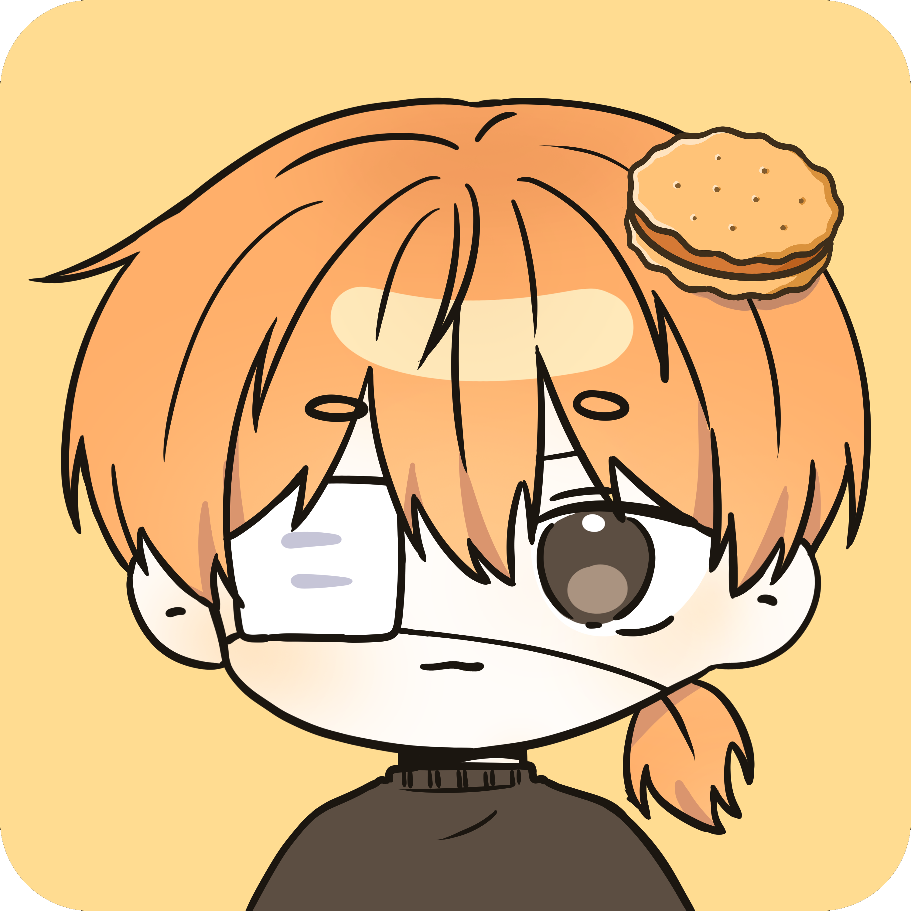

  
   

  
  
  
  
   

  <!--
<strong></strong>
-->
  
🧀 관상용 과자 먹지 마시오 🧀

   

  

💬 Discord
 
    
    
  

  

⚙️ Language
 
    
    
    
    
  

  

⛏️ Minecraft
 
    
test 1

    
test 2

    
test 3

  

  

📑 State
 
    
    
  

  

